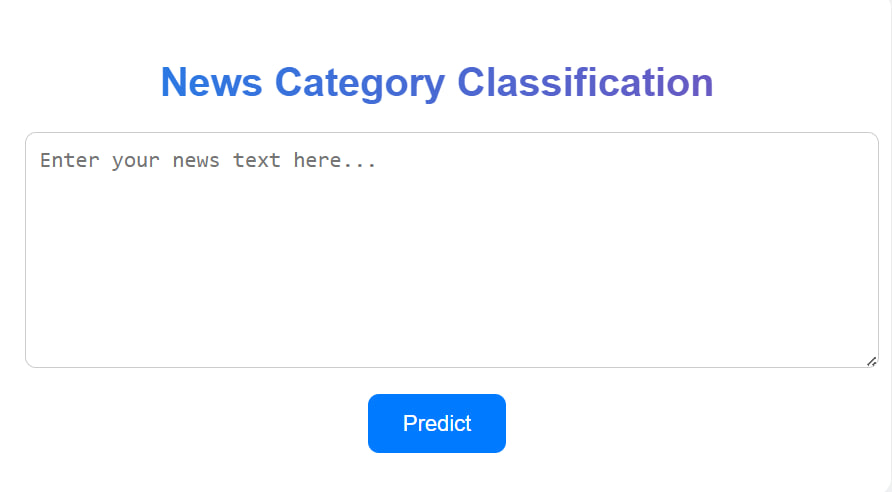
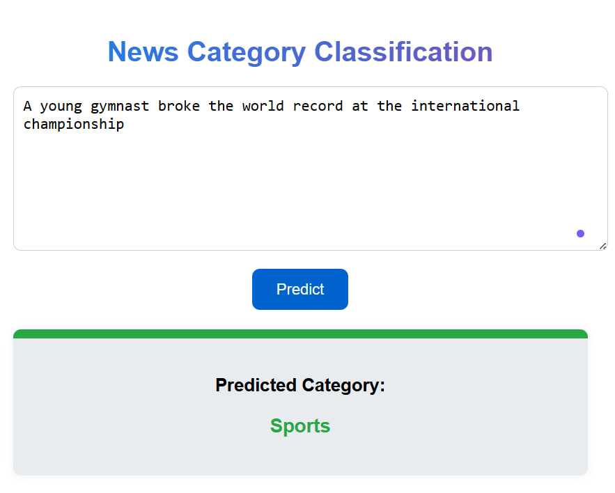
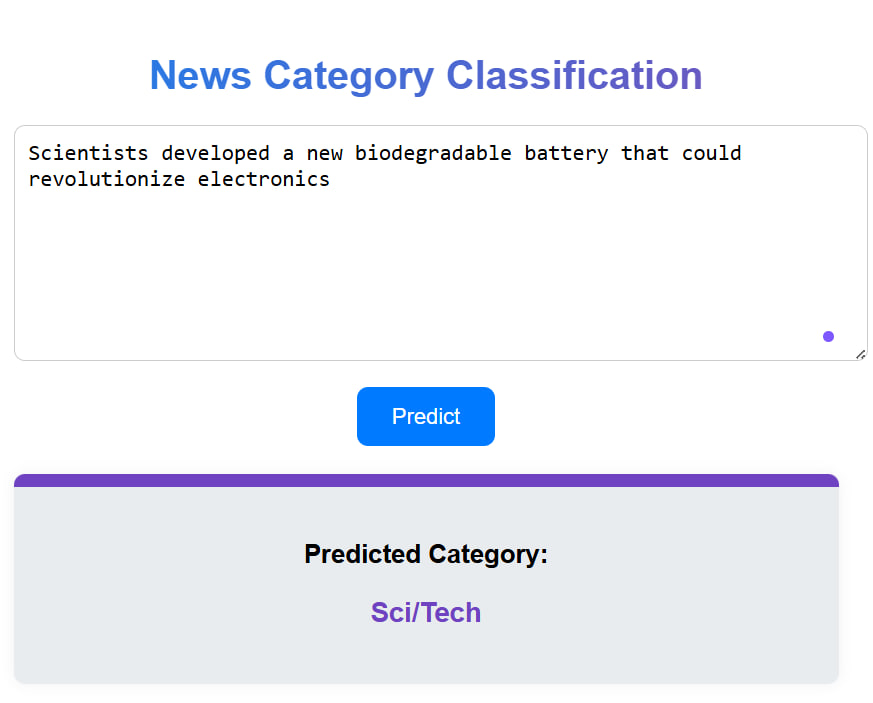
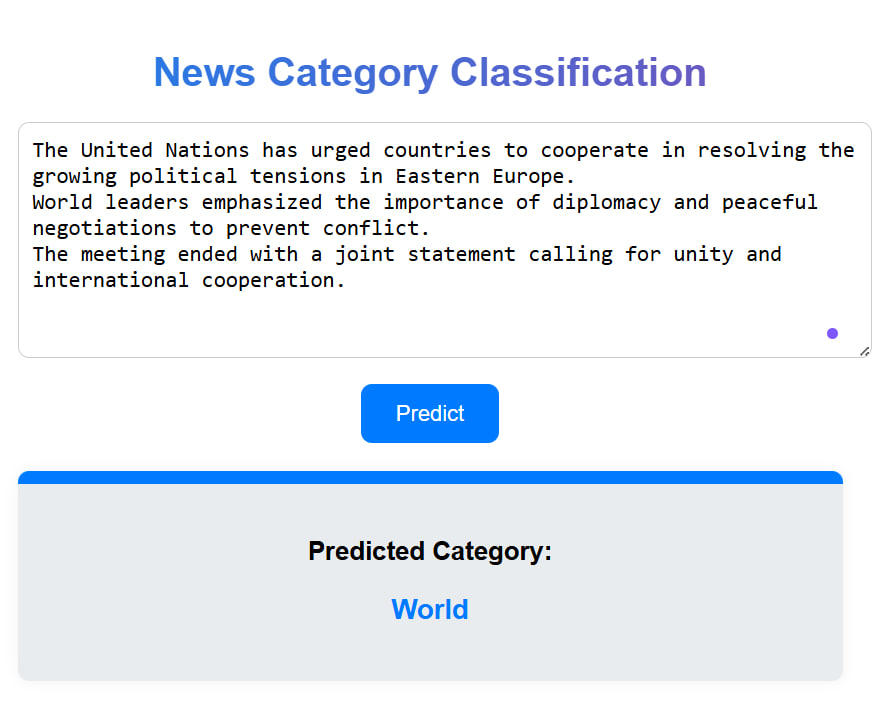
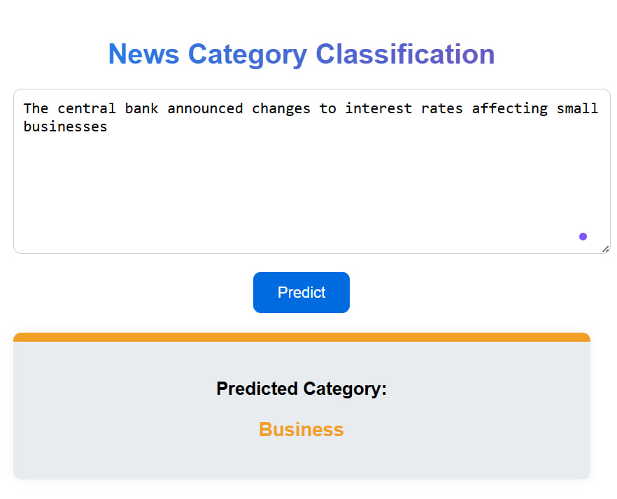

# 📰 News Category Classification

## 📌 Overview

This project aims to classify news articles into predefined categories such as **World**, **Sports**, **Business**, and **Science/Technology** using **Machine Learning** and **Natural Language Processing (NLP)** techniques.

---

## 🗂️ Dataset

**Dataset Used:** [AG News Dataset (Kaggle)](https://www.kaggle.com/datasets/amananandrai/ag-news-classification-dataset)

The dataset contains around:

* **120,000 training samples**
* **7,600 testing samples**

---

## 🧩 Workflow

### 1️⃣ Load the Dataset

Read `train.csv` and `test.csv` files.

### 2️⃣ Data Preprocessing

* Remove special characters and numbers.
* Convert text to lowercase.
* Remove stopwords.
* Apply lemmatization.

### 3️⃣ Feature Extraction

Use **TF-IDF Vectorization** to convert text into numerical features.

### 4️⃣ Model Training  
Train and compare multiple models:

- Logistic Regression (was selected as the final model for deployment).
- Random Forest
- XGBoost
- Neural Network (Keras)

### 5️⃣ Evaluation Metrics  
Evaluate models on:
- Accuracy  
- Precision  
- Recall  
- F1-score  
- Training Time 

### 6️⃣ Visualization (Bonus)

Generate **WordClouds** or bar charts showing most frequent words per category.

### 7️⃣ Neural Network (Bonus)

Build a simple **feedforward neural network** using **Keras** for comparison.

### 8️⃣ Deployment

- **Flask** used for web serving.
- The model is loaded using `joblib` and predicts the category for new text inputs.

---

## 📸 Screenshots

Here are some screenshots of the application in action:

**Home Page:**
  

---
**Sample 1:**
  

---
**Sample 2:**
  

---
**Sample 3:**
  

---
**Sample 4:**
  

---
